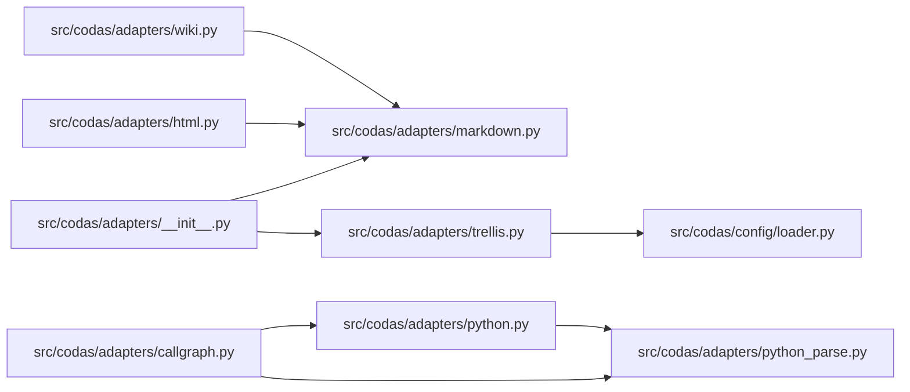

<!-- GENERATED by `codas wiki --write`. Do not edit by hand; regenerate to refresh. -->

# codas-adapters

- **Path:** `src/codas/adapters`
- **Owner:** Codas Core
- **Kind:** adapters_module

> **Open-world.** The structure below is a sound LOWER BOUND — an absent function, method, or edge is not proof of absence (static facts under-approximate; see `codas impact`). Misses: calls outside a function/method body (module-level, class-body, decorator, or default-argument expressions); dynamic dispatch / calls through variables or returns; super() / MRO / cross-class instance dispatch; reflection (getattr / dynamic); builtins and external (non-first-party) calls

## Modules & symbols

### `src/codas/adapters/callgraph.py`

- `CallFact` *(class)*
- `CallFacts` *(class)*
- `_Module` *(class)*
- `_bindings` *(function)*
- `_local_names` *(function)*
- `_module_edges` *(function)*
- `_module_name` *(function)*
- `_modules_from_parsed` *(function)*
- `_resolve_call` *(function)*
- `_resolve_from` *(function)*
- `_walk_no_nested` *(function)*
- `_walk_scope` *(function)*
- `extract_call_facts` *(function)*
- `extract_call_facts_from_parsed` *(function)*

### `src/codas/adapters/git.py`

- `_git_lines` *(function)*
- `extract_changed_paths` *(function)*
- `list_python_paths_at_head` *(function)*
- `read_blob_at_head` *(function)*

### `src/codas/adapters/html.py`

- `_ClaimParser` *(class)*
  - `_emit_href` *(function)*
  - `handle_startendtag` *(function)*
  - `handle_starttag` *(function)*
- `_strip_dot_slash` *(function)*
- `extract_html_claims` *(function)*
- `governed_html_files` *(function)*

### `src/codas/adapters/markdown.py`

- `DocClaim` *(class)*
- `_candidates` *(function)*
- `_join` *(function)*
- `_normalize` *(function)*
- `_resolve` *(function)*
- `extract_doc_claims` *(function)*

### `src/codas/adapters/python.py`

- `ImportFact` *(class)*
- `ImportFacts` *(class)*
- `SymbolFact` *(class)*
- `SymbolFacts` *(class)*
- `_resolve_import` *(function)*
- `_targets` *(function)*
- `dotted_for` *(function)*
- `extract_import_facts` *(function)*
- `extract_import_facts_from_parsed` *(function)*
- `extract_symbol_facts` *(function)*
- `extract_symbol_facts_from_parsed` *(function)*
- `package_dirs_of` *(function)*

### `src/codas/adapters/python_parse.py`

- `ParsedModule` *(class)*
- `ParsedModules` *(class)*
- `_parse_one` *(function)*
- `parse_python_modules` *(function)*
- `parse_sources` *(function)*

### `src/codas/adapters/semantic.py`

- `SemanticClaims` *(class)*
- `StructuralClaim` *(class)*
- `_norm_node` *(function)*
- `_parse_claim` *(function)*
- `extract_semantic_claims` *(function)*

### `src/codas/adapters/trellis.py`

- `TaskFact` *(class)*
- `TaskFacts` *(class)*
- `_optional_str` *(function)*
- `extract_task_facts` *(function)*

### `src/codas/adapters/wiki.py`

- `GeneratedClaim` *(class)*
- `GeneratedClaims` *(class)*
- `GeneratedPage` *(class)*
- `WikiClaim` *(class)*
- `WikiClaims` *(class)*
- `_concept_slug` *(function)*
- `_exists` *(function)*
- `_heading` *(function)*
- `_wiki_normalize` *(function)*
- `extract_generated_claims` *(function)*
- `extract_wiki_claims` *(function)*

## Dependencies

