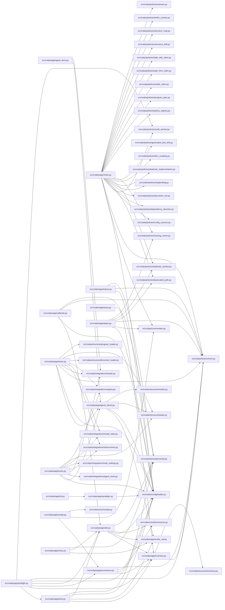

<!-- GENERATED by `codas wiki --write`. Do not edit by hand; regenerate to refresh. -->

# codas-app

- **Path:** `src/codas/app`
- **Owner:** Codas Core
- **Kind:** application_services

## Overview

`codas-app` is the orchestration layer that sits between the thin CLI shell and the deterministic fact/policy engines. Each module here is a *service*: it loads `.codas/` config, builds (or reuses) a single `ScanContext`, drives the right engine, and shapes the result for a command. `run_check_with_context` is the canonical example — it loads config, builds one scan context, fans it across every policy in `codas.policies`, and returns the `CheckReport` plus the context so `check --json` can pin provenance from the *same* scan instead of re-parsing the tree. This single-snapshot discipline recurs throughout: `build_context_pack` and `compute_provenance` both build the inventory once so a task's facts and its `inventory_hash` can never disagree.

The defining boundary is what this layer is *forbidden* to touch. By design `codas-app` honors its own `must_not_depend_on: [codas-adapters]` rule — facts arrive only through the `codas.facts` seam (`ScanContext`, `CallFacts`), never by importing an adapter, and the `dependency_direction` policy dogfoods that constraint back onto this very directory. `hooks.py` exists precisely because the CLI umbrella may not reach `role-integrations` directly, so app orchestration is the one permitted bridge. The dependency arrow always points downward: app → core/facts, never the reverse.

The second invariant is open-world honesty. Anything projected from static facts is a sound *lower bound*, and these services refuse to let that caveat get lost at the presentation layer. `compute_impact` (reverse reachability over `calls`), `project_atlas_tree`, the Mermaid/HTML views, and the human book all embed the same "absence is not denial" note drawn from `codas.facts.openworld` — a dependency picture that read as complete would re-import a false-completeness failure.

The third is byte-identical determinism. The Atlas pack, knowledge tree, generated governance page, and the `wiki/` book are all *pure projections* of the inventory dict with explicit total sort keys, no timestamps, and no LLM in the core (§17). Freshness rides in the rendered bytes: `verify_book` and `verify_generated_sections` are plain byte-compares, and derived outputs are scanner-excluded so the book never feeds its own hash. `calibrate.py` is the lone semantic touchpoint, and even it only *tiers* host-authored claims against facts — it confirms structure exists, never the concept the prose wraps around it.

> **Open-world.** The structure below is a sound LOWER BOUND — an absent function, method, or edge is not proof of absence (static facts under-approximate; see `codas impact`). Misses: calls outside a function/method body (module-level, class-body, decorator, or default-argument expressions); dynamic dispatch / calls through variables or returns; super() / MRO / cross-class instance dispatch; reflection (getattr / dynamic); builtins and external (non-first-party) calls

## Modules & symbols

### `src/codas/app/agent_docs.py`

- `verify_agent_docs` *(function)*
- `write_agent_docs` *(function)*

### `src/codas/app/agents_block.py`

- `_blurb` *(function)*
- `_enforcement` *(function)*
- `agents_pages` *(function)*
- `render_codas_block` *(function)*
- `splice_managed_block` *(function)*
- `verify_agents_block` *(function)*
- `write_agents_block` *(function)*

### `src/codas/app/book.py`

- `_chapter_filename` *(function)*
- `_chapter_unit_ids` *(function)*
- `_open_world_banner` *(function)*
- `_read_chapter_prose` *(function)*
- `_render_chapter` *(function)*
- `_render_index` *(function)*
- `_render_symbol_tree` *(function)*
- `_strip_claims_block` *(function)*
- `_under_path` *(function)*
- `_unit_by_id` *(function)*
- `book_pages` *(function)*
- `project_book` *(function)*
- `verify_book` *(function)*
- `write_book` *(function)*

### `src/codas/app/calibrate.py`

- `_absent` *(function)*
- `_calls_index` *(function)*
- `_claim_row` *(function)*
- `build_feed` *(function)*
- `calibrate` *(function)*
- `run_calibrate` *(function)*
- `tier` *(function)*

### `src/codas/app/check.py`

- `_rel` *(function)*
- `run_check` *(function)*
- `run_check_with_context` *(function)*

### `src/codas/app/doctor.py`

- `Diagnostic` *(class)*
- `_agent_session_diag` *(function)*
- `_agents_block` *(function)*
- `_claude_shim` *(function)*
- `_codex_diags` *(function)*
- `_freshness` *(function)*
- `_git_hooks` *(function)*
- `_git_repo` *(function)*
- `_legacy_prototype` *(function)*
- `_optional` *(function)*
- `_required` *(function)*
- `_session_slice` *(function)*
- `_trellis_context` *(function)*
- `_turn_diag` *(function)*
- `doctor_has_failures` *(function)*
- `run_doctor` *(function)*

### `src/codas/app/hooks.py`

- `AgentInjectionResult` *(class)*
- `AgentInstall` *(class)*
- `_agent_hook_state` *(function)*
- `_doc_freshness` *(function)*
- `_ensure_gitignored` *(function)*
- `emit_agent_turn_hook` *(function)*
- `install_agent_injection` *(function)*
- `install_git_hooks` *(function)*

### `src/codas/app/impact.py`

- `_GraphEdge` *(class)*
- `_Node` *(class)*
- `_affected_row` *(function)*
- `_all_nodes` *(function)*
- `_call_edges` *(function)*
- `_callee_node` *(function)*
- `_caller_node` *(function)*
- `_codegraph_edges` *(function)*
- `_compute_impact_edges` *(function)*
- `_fqn` *(function)*
- `_looks_like_path` *(function)*
- `_norm_path` *(function)*
- `_open_world_note` *(function)*
- `_resolve_targets` *(function)*
- `_reverse_graph` *(function)*
- `_reverse_reach` *(function)*
- `_symbol_matches` *(function)*
- `_to_repo_rel` *(function)*
- `compute_impact` *(function)*
- `render_impact_text` *(function)*
- `run_impact` *(function)*

### `src/codas/app/init.py`

- `ScaffoldResult` *(class)*
- `scaffold` *(function)*

### `src/codas/app/inventory.py`

- `render_inventory_json` *(function)*
- `render_inventory_summary` *(function)*
- `run_inventory` *(function)*

### `src/codas/app/paradigm.py`

- `LayerRole` *(class)*
- `Preset` *(class)*
- `PresetError` *(class)*
- `RenderedParadigm` *(class)*
- `_parse_preset` *(function)*
- `_parse_roles` *(function)*
- `_prose` *(function)*
- `_require_str` *(function)*
- `_require_str_list` *(function)*
- `detect_ecosystems` *(function)*
- `is_advisory` *(function)*
- `list_presets` *(function)*
- `load_preset` *(function)*
- `render_paradigm` *(function)*
- `render_structure_yaml` *(function)*

### `src/codas/app/preflight.py`

- `_build_digest` *(function)*
- `_codegraph_reuse_hints` *(function)*
- `_repair_targets` *(function)*
- `_repair_value` *(function)*
- `build_context_pack` *(function)*

### `src/codas/app/provenance.py`

- `_safe` *(function)*
- `compute_provenance` *(function)*
- `provenance_block` *(function)*

### `src/codas/app/query.py`

- `QueryError` *(class)*
- `_row_matches` *(function)*
- `_rows_for` *(function)*
- `_scalar_str` *(function)*
- `kinds` *(function)*
- `parse_selectors` *(function)*
- `run_query` *(function)*
- `run_schema` *(function)*

### `src/codas/app/receipt.py`

- `_basic` *(function)*
- `_iso` *(function)*
- `_utc` *(function)*
- `build_receipt` *(function)*
- `write_receipt` *(function)*

### `src/codas/app/render_util.py`

- `guard_table_cell` *(function)*
- `mermaid_label` *(function)*

### `src/codas/app/status.py`

- `StatusResult` *(class)*
- `_artifact_findings` *(function)*
- `_duplicate_findings` *(function)*
- `_fingerprint` *(function)*
- `_read_state` *(function)*
- `_run_status` *(function)*
- `_shown_rows` *(function)*
- `_write_state` *(function)*
- `inject_context` *(function)*
- `read_baseline` *(function)*
- `record_baseline` *(function)*
- `render_additional_context` *(function)*
- `render_text` *(function)*
- `run_status` *(function)*

### `src/codas/app/views.py`

- `_html_escape` *(function)*
- `_import_caveat` *(function)*
- `_render_nav` *(function)*
- `_tree_roots` *(function)*
- `build_html` *(function)*
- `build_mermaid` *(function)*

### `src/codas/app/wiki.py`

- `_claim_token` *(function)*
- `_code` *(function)*
- `_config_product_roots` *(function)*
- `_generated_pages` *(function)*
- `_node_id` *(function)*
- `_owner_index` *(function)*
- `_owning` *(function)*
- `_parent_dir` *(function)*
- `_plain` *(function)*
- `_under_any` *(function)*
- `build_atlas_pack` *(function)*
- `build_atlas_tree` *(function)*
- `product_roots` *(function)*
- `project_atlas_pack` *(function)*
- `project_atlas_tree` *(function)*
- `render_generated_overview` *(function)*
- `verify_generated_sections` *(function)*
- `write_generated_sections` *(function)*

## Dependencies

