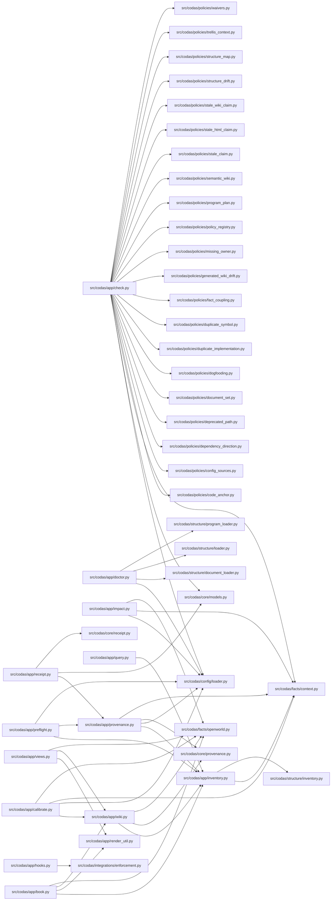

<!-- GENERATED by `codas wiki --write`. Do not edit by hand; regenerate to refresh. -->

# codas-app

- **Path:** `src/codas/app`
- **Owner:** Codas Core
- **Kind:** application_services

> **Open-world.** The structure below is a sound LOWER BOUND — an absent function, method, or edge is not proof of absence (static facts under-approximate; see `codas impact`). Misses: calls outside a function/method body (module-level, class-body, decorator, or default-argument expressions); dynamic dispatch / calls through variables or returns; super() / MRO / cross-class instance dispatch; reflection (getattr / dynamic); builtins and external (non-first-party) calls

## Modules & symbols

### `src/codas/app/book.py`

- `_chapter_filename` *(function)*
- `_chapter_unit_ids` *(function)*
- `_open_world_banner` *(function)*
- `_render_chapter` *(function)*
- `_render_index` *(function)*
- `_render_symbol_tree` *(function)*
- `_under_path` *(function)*
- `_unit_by_id` *(function)*
- `book_pages` *(function)*
- `project_book` *(function)*
- `verify_book` *(function)*
- `write_book` *(function)*

### `src/codas/app/calibrate.py`

- `_absent` *(function)*
- `_calls_index` *(function)*
- `_claim_row` *(function)*
- `build_feed` *(function)*
- `calibrate` *(function)*
- `run_calibrate` *(function)*
- `tier` *(function)*

### `src/codas/app/check.py`

- `_rel` *(function)*
- `run_check` *(function)*
- `run_check_with_context` *(function)*

### `src/codas/app/doctor.py`

- `Diagnostic` *(class)*
- `_git_repo` *(function)*
- `_legacy_prototype` *(function)*
- `_optional` *(function)*
- `_required` *(function)*
- `_trellis_context` *(function)*
- `doctor_has_failures` *(function)*
- `run_doctor` *(function)*

### `src/codas/app/hooks.py`

- `install_git_hooks` *(function)*

### `src/codas/app/impact.py`

- `_Node` *(class)*
- `_all_nodes` *(function)*
- `_callee_node` *(function)*
- `_caller_node` *(function)*
- `_fqn` *(function)*
- `_looks_like_path` *(function)*
- `_norm_path` *(function)*
- `_open_world_note` *(function)*
- `_resolve_targets` *(function)*
- `_reverse_graph` *(function)*
- `_reverse_reach` *(function)*
- `_symbol_matches` *(function)*
- `_to_repo_rel` *(function)*
- `compute_impact` *(function)*
- `render_impact_text` *(function)*
- `run_impact` *(function)*

### `src/codas/app/init.py`

- `ScaffoldResult` *(class)*
- `scaffold` *(function)*

### `src/codas/app/inventory.py`

- `render_inventory_json` *(function)*
- `render_inventory_summary` *(function)*
- `run_inventory` *(function)*

### `src/codas/app/preflight.py`

- `build_context_pack` *(function)*

### `src/codas/app/provenance.py`

- `_safe` *(function)*
- `compute_provenance` *(function)*
- `provenance_block` *(function)*

### `src/codas/app/query.py`

- `QueryError` *(class)*
- `_row_matches` *(function)*
- `_rows_for` *(function)*
- `_scalar_str` *(function)*
- `kinds` *(function)*
- `parse_selectors` *(function)*
- `run_query` *(function)*
- `run_schema` *(function)*

### `src/codas/app/receipt.py`

- `_basic` *(function)*
- `_iso` *(function)*
- `_utc` *(function)*
- `build_receipt` *(function)*
- `write_receipt` *(function)*

### `src/codas/app/render_util.py`

- `mermaid_label` *(function)*

### `src/codas/app/views.py`

- `_html_escape` *(function)*
- `_import_caveat` *(function)*
- `_render_nav` *(function)*
- `_tree_roots` *(function)*
- `build_html` *(function)*
- `build_mermaid` *(function)*

### `src/codas/app/wiki.py`

- `_claim_token` *(function)*
- `_code` *(function)*
- `_generated_pages` *(function)*
- `_guard_cell` *(function)*
- `_in_product` *(function)*
- `_node_id` *(function)*
- `_owner_index` *(function)*
- `_owning` *(function)*
- `_parent_dir` *(function)*
- `_plain` *(function)*
- `build_atlas_pack` *(function)*
- `build_atlas_tree` *(function)*
- `project_atlas_pack` *(function)*
- `project_atlas_tree` *(function)*
- `render_generated_overview` *(function)*
- `verify_generated_sections` *(function)*
- `write_generated_sections` *(function)*

## Dependencies

