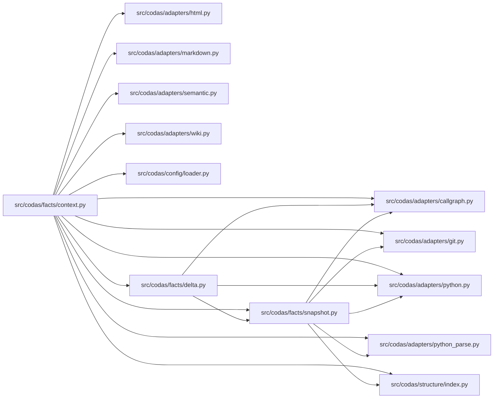

<!-- GENERATED by `codas wiki --write`. Do not edit by hand; regenerate to refresh. -->

# codas-facts

- **Path:** `src/codas/facts`
- **Owner:** Codas Core
- **Kind:** facts_module

> **Open-world.** The structure below is a sound LOWER BOUND — an absent function, method, or edge is not proof of absence (static facts under-approximate; see `codas impact`). Misses: calls outside a function/method body (module-level, class-body, decorator, or default-argument expressions); dynamic dispatch / calls through variables or returns; super() / MRO / cross-class instance dispatch; reflection (getattr / dynamic); builtins and external (non-first-party) calls

## Modules & symbols

### `src/codas/facts/context.py`

- `ScanContext` *(class)*
  - `_parsed` *(function)*
  - `calls` *(function)*
  - `changed_paths` *(function)*
  - `code_anchor_claims` *(function)*
  - `doc_claims` *(function)*
  - `fact_delta` *(function)*
  - `generated_claims` *(function)*
  - `head_snapshot` *(function)*
  - `html_claims` *(function)*
  - `imports` *(function)*
  - `semantic_corpus_claims` *(function)*
  - `semantic_wiki_claims` *(function)*
  - `symbols` *(function)*
  - `wiki_claims` *(function)*
  - `working_snapshot` *(function)*
- `build_scan_context` *(function)*

### `src/codas/facts/delta.py`

- `FactDelta` *(class)*
- `_call_key` *(function)*
- `_import_key` *(function)*
- `_import_sort` *(function)*
- `_symbol_key` *(function)*
- `diff_snapshots` *(function)*

### `src/codas/facts/openworld.py`

- `open_world_gaps` *(function)*
- `world_of` *(function)*

### `src/codas/facts/snapshot.py`

- `FactSnapshot` *(class)*
- `head_snapshot` *(function)*
- `snapshot_from_parsed` *(function)*

## Dependencies

