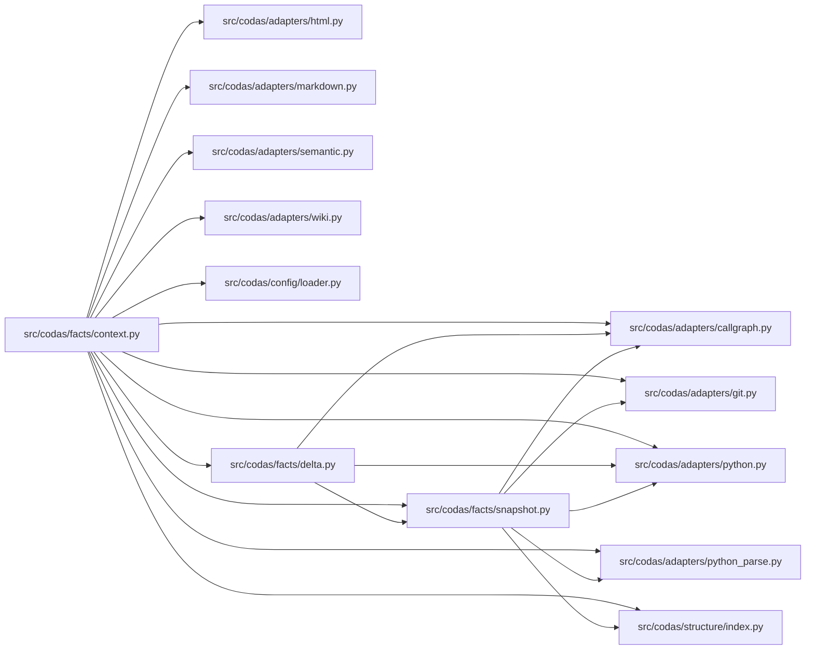

<!-- GENERATED by `codas wiki --write`. Do not edit by hand; regenerate to refresh. -->

# codas-facts

- **Path:** `src/codas/facts`
- **Owner:** Codas Core
- **Kind:** facts_module

## Overview

The `facts` package is the **adapter boundary made concrete** — the one seam where raw ecosystem-adapter output (`ast`-parsed Python, git blobs, markdown/HTML/wiki text) crosses into the *normalized facts* the policy and app layers are allowed to consume. The plan's hard rule is "Core may only receive normalized facts and claims," and `ScanContext` (in `context.py`) is what enforces it: policies receive a `ScanContext` and read facts through its accessors, but never import an adapter themselves. The modules under `facts/` are the *only* place outside `codas.adapters` permitted to import an adapter, which is why this package, small as it is, is structurally load-bearing.

`ScanContext` is built once per run by `build_scan_context`, which resolves the workspace roots and scans the tree a single time. Every accessor (`symbols()`, `imports()`, `calls()`, `doc_claims()`, `html_claims()`, …) memoizes its adapter call, so a working-tree scan and an `ast.parse` pass each happen exactly once even when many policies ask — and each repeated read returns the *identical, adapter-sorted* result, which is what keeps the run deterministic and the inventory byte-identical.

### Snapshots, deltas, and the open-world line
`FactSnapshot` (`snapshot.py`) bundles the three code-fact streams (symbols / imports / calls) at one point in time; crucially it is a *pure function of file-set + content*, deriving package membership from the file set rather than the live filesystem, so the **same builder works for the working tree and for a git ref** — `head_snapshot` reads `.py` blobs at `HEAD` and returns `None` (never a partial snapshot) on any failure, so a missing file can't masquerade as removed facts. `diff_snapshots` (`delta.py`) then produces a `FactDelta` of *identity keys* (dropping line numbers) so a def shifting down three lines is not spurious drift — this is the substrate spec-drift couplings fire on. Snapshots and deltas are deliberately *policy-time* facts: like `changed_paths`, they reflect mutable/ref state and are never serialized into the hashed inventory.

`openworld.py` encodes the package's defining invariant: static code facts are an **open-world sound lower bound** — a positive reading ("A calls B") is 100% reliable, but absence is *unknown*, not denial (Rice's theorem). It carries no per-fact inventory marker; instead `world_of` and `open_world_gaps` expose a static registry (`WORLD_BY_FAMILY`) telling consumers — `codas impact`, the W3 calibrator — to read missing edges as UNCONFIRMED, never CONTRADICTED, while genuinely closed-world config families (units/tasks) remain the only place absence is evidence.

> **Open-world.** The structure below is a sound LOWER BOUND — an absent function, method, or edge is not proof of absence (static facts under-approximate; see `codas impact`). Misses: calls outside a function/method body (module-level, class-body, decorator, or default-argument expressions); dynamic dispatch / calls through variables or returns; super() / MRO / cross-class instance dispatch; reflection (getattr / dynamic); builtins and external (non-first-party) calls

## Modules & symbols

### `src/codas/facts/context.py`

- `ScanContext` *(class)*
  - `_derived_prefixes` *(function)*
  - `_parsed` *(function)*
  - `calls` *(function)*
  - `changed_paths` *(function)*
  - `changed_since` *(function)*
  - `code_anchor_claims` *(function)*
  - `doc_claims` *(function)*
  - `fact_delta` *(function)*
  - `generated_claims` *(function)*
  - `git_baseline` *(function)*
  - `head_snapshot` *(function)*
  - `html_claims` *(function)*
  - `imports` *(function)*
  - `ref_resolves` *(function)*
  - `semantic_corpus_claims` *(function)*
  - `symbols` *(function)*
  - `wiki_claims` *(function)*
  - `working_snapshot` *(function)*
- `build_scan_context` *(function)*
- `repo_git_baseline` *(function)*

### `src/codas/facts/delta.py`

- `FactDelta` *(class)*
- `_call_key` *(function)*
- `_import_key` *(function)*
- `_import_sort` *(function)*
- `_symbol_key` *(function)*
- `diff_snapshots` *(function)*

### `src/codas/facts/openworld.py`

- `open_world_gaps` *(function)*
- `world_of` *(function)*

### `src/codas/facts/snapshot.py`

- `FactSnapshot` *(class)*
- `head_snapshot` *(function)*
- `snapshot_from_parsed` *(function)*

## Dependencies

