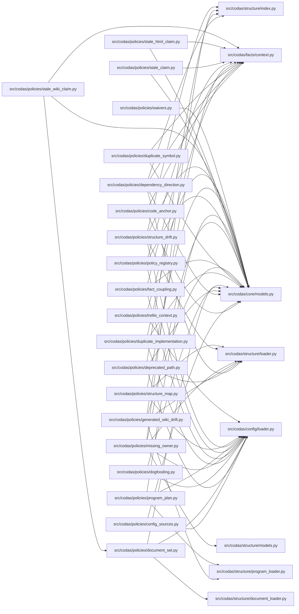

<!-- GENERATED by `codas wiki --write`. Do not edit by hand; regenerate to refresh. -->

# codas-policies

- **Path:** `src/codas/policies`
- **Owner:** Policy Maintainer
- **Kind:** policy_module

> **Open-world.** The structure below is a sound LOWER BOUND — an absent function, method, or edge is not proof of absence (static facts under-approximate; see `codas impact`). Misses: calls outside a function/method body (module-level, class-body, decorator, or default-argument expressions); dynamic dispatch / calls through variables or returns; super() / MRO / cross-class instance dispatch; reflection (getattr / dynamic); builtins and external (non-first-party) calls

## Modules & symbols

### `src/codas/policies/code_anchor.py`

- `_add_path_nodes` *(function)*
- `check_code_anchor` *(function)*

### `src/codas/policies/config_sources.py`

- `_rel` *(function)*
- `check_config_sources` *(function)*

### `src/codas/policies/dependency_direction.py`

- `_first_forbidden` *(function)*
- `_owning_unit_of` *(function)*
- `check_dependency_direction` *(function)*

### `src/codas/policies/deprecated_path.py`

- `check_deprecated_path_used` *(function)*

### `src/codas/policies/document_set.py`

- `_matches_any` *(function)*
- `check_document_set` *(function)*

### `src/codas/policies/dogfooding.py`

- `_html_fragment_exists` *(function)*
- `_rel` *(function)*
- `_split_fragment` *(function)*
- `check_dogfooding_protocol` *(function)*

### `src/codas/policies/duplicate_implementation.py`

- `_entry_problem` *(function)*
- `_read_relationships` *(function)*
- `_schema_invalid` *(function)*
- `check_duplicate_implementation` *(function)*

### `src/codas/policies/duplicate_symbol.py`

- `check_duplicate_symbol` *(function)*

### `src/codas/policies/fact_coupling.py`

- `_any_match` *(function)*
- `_delta_has_match` *(function)*
- `_malformed` *(function)*
- `_module_and_identity` *(function)*
- `_norm` *(function)*
- `_schema_problem` *(function)*
- `_stream` *(function)*
- `_under` *(function)*
- `check_fact_coupling` *(function)*

### `src/codas/policies/generated_wiki_drift.py`

- `_unit_paths` *(function)*
- `_verify_mapping` *(function)*
- `_work_item_status` *(function)*
- `check_generated_wiki_drift` *(function)*

### `src/codas/policies/missing_owner.py`

- `_common_leading` *(function)*
- `_literal_head` *(function)*
- `check_missing_structure_owner` *(function)*
- `nearest_candidate_units` *(function)*

### `src/codas/policies/policy_registry.py`

- `check_policy_registry` *(function)*

### `src/codas/policies/program_plan.py`

- `check_program_plan` *(function)*

### `src/codas/policies/stale_claim.py`

- `check_stale_claim` *(function)*

### `src/codas/policies/stale_html_claim.py`

- `check_stale_html_claim` *(function)*

### `src/codas/policies/stale_wiki_claim.py`

- `check_stale_wiki_claim` *(function)*

### `src/codas/policies/structure_drift.py`

- `check_structure_drift` *(function)*

### `src/codas/policies/structure_map.py`

- `check_structure_map` *(function)*

### `src/codas/policies/trellis_context.py`

- `_rel` *(function)*
- `check_trellis_context` *(function)*

### `src/codas/policies/waivers.py`

- `_invalid` *(function)*
- `_rel` *(function)*
- `check_waivers` *(function)*

## Dependencies

