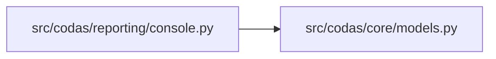

<!-- GENERATED by `codas wiki --write`. Do not edit by hand; regenerate to refresh. -->

# codas-reporting

- **Path:** `src/codas/reporting`
- **Owner:** Codas Core
- **Kind:** reporting_module

## Overview

The `reporting` subsystem is Codas's human-facing presentation layer: a tiny, dependency-free module whose only job is to render already-computed results to the console for a person to read. It contains two functions in `console.py` — `print_findings`, which formats a `list[Finding]` from a check run, and `print_context_pack`, which summarizes the dict produced by `preflight`. Both write to stdout via plain `print`; neither computes, decides, or mutates anything.

The reason it exists as its own subsystem is the *split* you see at the call sites in `cli.py`: every command that produces output offers two render paths. When `--json` is set, the CLI emits `report.to_json()` plus `compute_provenance(...)` through `json.dumps(..., sort_keys=True)` — the machine-readable, content-hashed, byte-identical path that other tools and the determinism invariant depend on. When it is not set, the CLI hands the same data to `print_findings` / `print_context_pack`. Keeping the cosmetic, human-only formatting here means it can never leak into the hashed surface: the structured JSON is the authoritative artifact, and console prose is a convenience view that can change freely without touching provenance.

### Boundaries it upholds
Reporting is a strict downstream *consumer*. It imports only `codas.core.models` (`Finding`/`Evidence`) and reads, never writes, governance state — it sees no adapters, no `ScanContext`, no policies. It applies a deterministic display order (`error`/`warning`/`info`, then `check_id`) and degrades gracefully on empty input ("No Codas findings."), but it is intentionally dumb: all correctness lives upstream, so this layer carries no part of the no-LLM, open-world, deterministic core.

> **Open-world.** The structure below is a sound LOWER BOUND — an absent function, method, or edge is not proof of absence (static facts under-approximate; see `codas impact`). Misses: calls outside a function/method body (module-level, class-body, decorator, or default-argument expressions); dynamic dispatch / calls through variables or returns; super() / MRO / cross-class instance dispatch; reflection (getattr / dynamic); builtins and external (non-first-party) calls

## Modules & symbols

### `src/codas/reporting/console.py`

- `_node_value` *(function)*
- `_print_digest` *(function)*
- `print_context_pack` *(function)*
- `print_findings` *(function)*

## Dependencies

