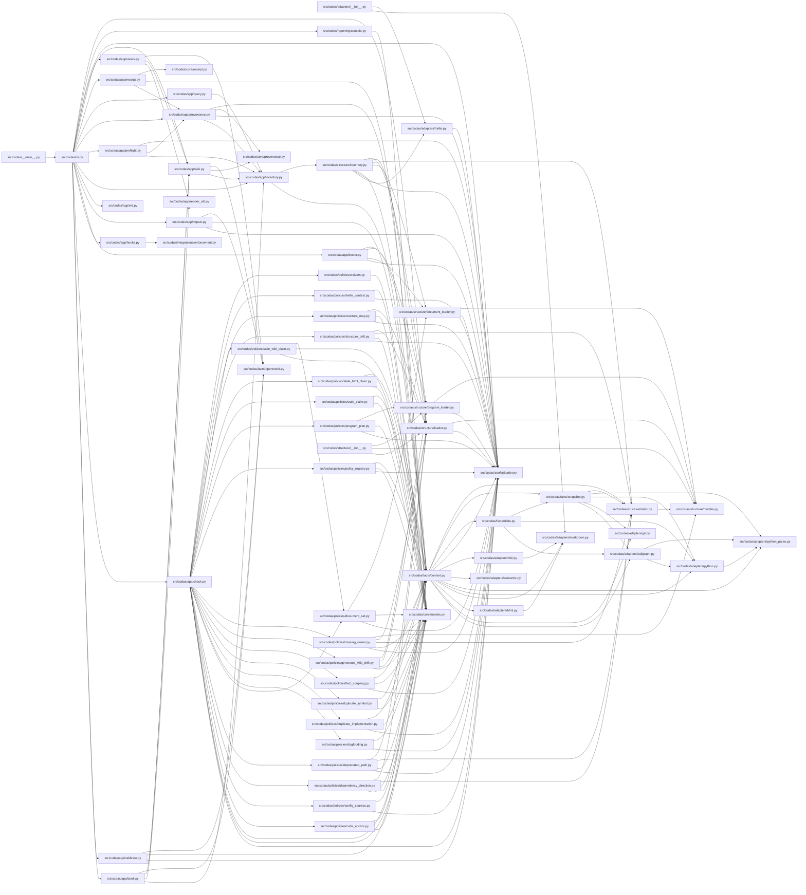

<!-- GENERATED by `codas wiki --write`. Do not edit by hand; regenerate to refresh. -->

# codas-source

- **Path:** `src/codas`
- **Owner:** Codas Core
- **Kind:** package

## Overview

`src/codas` is the whole Codas implementation: an agent-agnostic, deterministic CLI that governs a codebase by turning repo facts into authored claims, verified governance facts, policies, and findings. The package is layered by *trust*, not by feature. `cli.py` is a thin argparse dispatcher (`check`, `inventory`, `preflight`, `wiki`, `impact`, `query`, `schema`, `doctor`, `hooks`, `init`) that does no analysis itself — it parses args, resolves the repo root, and hands off to an `app/` orchestrator, lazily importing each command's module so a `check` run never pulls in wiki or HTML code. Beneath that sit `adapters/` (ecosystem readers: stdlib `ast`, git, markdown, html), `facts/` (the normalization seam), `policies/` (governance rules), `core/` (the `Finding`/`CheckReport` value types), and `structure/` (the declared Atlas inventory).

The architectural keystone is the **adapter boundary**, realized by `ScanContext` in `facts/context.py`. Policies and `app/` consume facts *only* through a `ScanContext`; they never import an adapter. `facts` is the one seam permitted to cross that line — `build_scan_context` scans the working tree exactly once and the frozen `ScanContext` memoizes each adapter call (`symbols()`, `imports()`, `calls()`, `doc_claims()`), so every policy reads identical, adapter-sorted output. This is what makes the byte-identical determinism invariant cheap to honor: one scan, one parse, cached normalized facts.

The correctness core is deliberately LLM-free. `app/check.py`'s `run_check_with_context` runs the fixed policy battery in a stable order and returns a `CheckReport` of `Finding`s — pure functions over facts, no model anywhere on the check/inventory/policy path. `policies/policy_registry.py` even dogfoods this: it proves the `check_*` functions actually implemented match what `.codas/policies.yml` declares, so the registry can never silently drift.

### The open-world invariant
`facts/openworld.py` encodes the subsystem's epistemic contract: statically extracted `symbols`/`imports`/`calls` are a *sound lower bound*, never complete (Rice's theorem — a positive reading is 100% reliable, but absence is UNKNOWN, not denial). Hence policies gate on *presence* (a duplicate found, a forbidden edge found), never on absence, while config/declared families (units, tasks, documents) are closed-world and their absence *is* evidence. `WORLD_BY_FAMILY`/`world_of()` expose this per-family so consumers like `codas impact` and the calibrator reason correctly without hardcoding it.

> **Open-world.** The structure below is a sound LOWER BOUND — an absent function, method, or edge is not proof of absence (static facts under-approximate; see `codas impact`). Misses: calls outside a function/method body (module-level, class-body, decorator, or default-argument expressions); dynamic dispatch / calls through variables or returns; super() / MRO / cross-class instance dispatch; reflection (getattr / dynamic); builtins and external (non-first-party) calls

## Modules & symbols

### `src/codas/cli.py`

- `build_parser` *(function)*
- `main` *(function)*

## Dependencies

