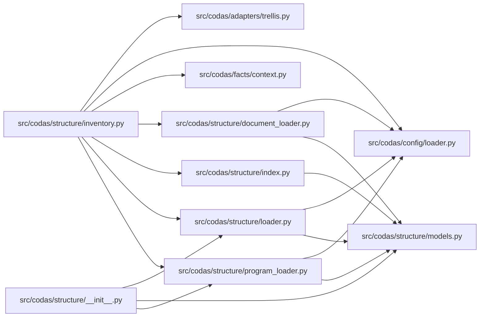

<!-- GENERATED by `codas wiki --write`. Do not edit by hand; regenerate to refresh. -->

# codas-structure-module

- **Path:** `src/codas/structure`
- **Owner:** Structure Steward
- **Kind:** structure_module

## Overview

The structure module is where Codas turns three authored governance documents — the Structure Map (`.codas/structure.yml`), the Program Plan (`.codas/program.yml`), and the Document Role Manifest (`.codas/documents.yml`) — into typed, frozen, deterministic facts, and then reconciles those *declared* facts against what is *observed* on disk. It is the front half of the Atlas pipeline: authored claims in, a normalized inventory out, which downstream policies consume to detect drift (declared-but-absent units, unowned files, broken dependency rules, stale documents).

Two responsibilities are kept deliberately separate. The loaders (`load_structure_map`, `load_program_plan`, `load_document_manifest`) parse pyyaml-only YAML through the shared `load_yaml_mapping` and validate it hard — required fields, valid `status`/`authority` enums, referential integrity of `allowed_children` and `dependency_rules`, and (for the program) an iterative DFS cycle check in `_assert_acyclic` so a malformed plan fails loudly rather than producing a silent half-fact. Everything they emit is a frozen dataclass (`StructureUnit`, `WorkItem`, `DocumentRole`), so a fact, once built, cannot mutate underneath a policy.

### Observation and the open-world boundary
`index.py` does the reconciling. `build_artifact_index` scans the working tree, assigns every file a single owning unit by longest-prefix (literal beats glob via `_owning_unit`), and records per-unit existence and counts. The scan funnels through `filter_to_roots` — the *one* chokepoint that applies workspace roots and drops reserved Codas-rendered output (the `wiki/` book) so the inventory never chases its own derived bytes. `build_inventory` then projects a shared `ScanContext` into the normalized §5 JSON, never importing adapters directly except the trellis fact extractor. The observed counts are an open-world lower bound: a unit existing is asserted, but absence of files under it is reported, never used to deny.

> **Open-world.** The structure below is a sound LOWER BOUND — an absent function, method, or edge is not proof of absence (static facts under-approximate; see `codas impact`). Misses: calls outside a function/method body (module-level, class-body, decorator, or default-argument expressions); dynamic dispatch / calls through variables or returns; super() / MRO / cross-class instance dispatch; reflection (getattr / dynamic); builtins and external (non-first-party) calls

## Modules & symbols

### `src/codas/structure/document_loader.py`

- `DocumentManifestError` *(class)*
- `_mapping` *(function)*
- `_str_tuple` *(function)*
- `load_document_manifest` *(function)*

### `src/codas/structure/index.py`

- `ArtifactIndex` *(class)*
- `UnitObservation` *(class)*
- `_git_files` *(function)*
- `_is_glob` *(function)*
- `_literal_prefix` *(function)*
- `_matches` *(function)*
- `_owning_unit` *(function)*
- `_walk_files` *(function)*
- `build_artifact_index` *(function)*
- `derived_output_prefixes` *(function)*
- `discover_files` *(function)*
- `filter_to_roots` *(function)*
- `is_derived_output` *(function)*
- `normalize_path` *(function)*
- `workspace_roots` *(function)*

### `src/codas/structure/inventory.py`

- `build_inventory` *(function)*

### `src/codas/structure/loader.py`

- `StructureMapError` *(class)*
- `_load_dependency_rules` *(function)*
- `_load_deprecated_paths` *(function)*
- `_mapping` *(function)*
- `_optional_str` *(function)*
- `_str_tuple` *(function)*
- `load_structure_map` *(function)*

### `src/codas/structure/models.py`

- `DependencyRule` *(class)*
- `DeprecatedPath` *(class)*
- `DocumentManifest` *(class)*
- `DocumentRole` *(class)*
- `ProgramPlan` *(class)*
- `StructureMap` *(class)*
- `StructureUnit` *(class)*
- `WorkItem` *(class)*

### `src/codas/structure/program_loader.py`

- `ProgramPlanError` *(class)*
- `_assert_acyclic` *(function)*
- `_mapping` *(function)*
- `_str_tuple` *(function)*
- `load_program_plan` *(function)*

## Dependencies

