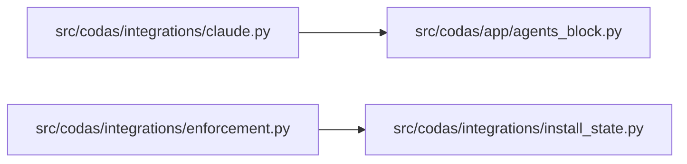

<!-- GENERATED by `codas wiki --write`. Do not edit by hand; regenerate to refresh. -->

# role-integrations

- **Path:** `src/codas/integrations`
- **Owner:** Codas Core
- **Kind:** integration_module

## Overview

**role-integrations** is the thin boundary where Codas wires itself into the platforms that actually run code review — git and CI — without ever letting those platforms reach into the correctness core. Its single working module, `enforcement.py`, knows how to *render* and *install* enforcement gates: `render_hook` emits a POSIX-sh git hook body that does `exec codas check .`, `render_workflow` emits the committed `.github/workflows/codas.yml` CI gate, and `install_hooks` writes the `pre-commit` / `pre-push` hooks into the repo's git hooks directory. Crucially, every one of these gates *shells out* to the `codas` CLI rather than calling Python — the §11 boundary the module docstring cites. The engine therefore stays integration-agnostic: nothing here imports check, inventory, or policy, and nothing there imports this.

The design rationale is "be a determinism layer under the host platform, not a runtime inside it." Because Codas is byte-identical and content-hashed, the rendered artifacts must be too: `render_hook` and `render_workflow` are pure and carry no timestamps, so re-installing an unchanged hook is a genuine no-op (`install_hooks` even skips the rewrite and `chmod` when the on-disk body already matches and is executable). This keeps hook churn out of dirty-tree noise and makes the install operation safely repeatable.

### Invariants it upholds

Two boundaries matter. First, *never trample a user's own hook*: `_is_codas_hook` requires the `HOOK_MARKER` to sit on line 2 exactly where `render_hook` places it, so a foreign hook merely mentioning the marker is preserved (recorded in `InstallResult.skipped`) and overwritten only under `force`. Second, *fail cleanly, never crash*: `_hooks_dir` honours `core.hooksPath` (resolving a relative value against the worktree root, as Git does), and returns `None` — surfaced as a no-op up the call chain — for a non-git repo, a bare repo, or a file-valued `hooksPath`. The app layer (`codas.app.hooks`) is the only permitted bridge; the CLI reaches enforcement through it, never directly.

> **Open-world.** The structure below is a sound LOWER BOUND — an absent function, method, or edge is not proof of absence (static facts under-approximate; see `codas impact`). Misses: calls outside a function/method body (module-level, class-body, decorator, or default-argument expressions); dynamic dispatch / calls through variables or returns; super() / MRO / cross-class instance dispatch; reflection (getattr / dynamic); builtins and external (non-first-party) calls

## Modules & symbols

### `src/codas/integrations/claude.py`

- `ClaudeHookResult` *(class)*
- `_is_ours` *(function)*
- `claude_shim_pages` *(function)*
- `install_claude_session_hook` *(function)*
- `render_claude_shim` *(function)*
- `resolve_agent_command` *(function)*
- `session_hook_status` *(function)*
- `verify_claude_shim` *(function)*
- `write_claude_shim` *(function)*

### `src/codas/integrations/enforcement.py`

- `InstallResult` *(class)*
- `_hooks_dir` *(function)*
- `_is_codas_hook` *(function)*
- `_worktree_root` *(function)*
- `_write_git_hook_state` *(function)*
- `git_hook_status` *(function)*
- `install_hooks` *(function)*
- `render_hook` *(function)*
- `render_workflow` *(function)*

### `src/codas/integrations/install_state.py`

- `hook_state` *(function)*
- `merge_install_state` *(function)*
- `read_install_state` *(function)*

## Dependencies

